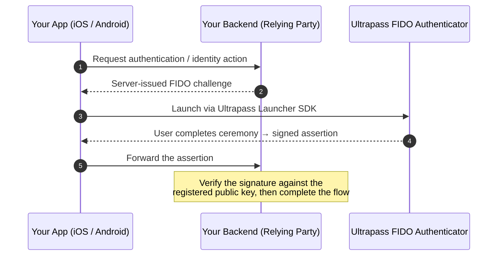

# Ultrapass® by Private Identity®

**Phishing-resistant authentication and privacy-preserving identity — without turning your user database into a honeypot.**

Ultrapass gives developers FIDO2/WebAuthn-based identity services for applications that need *strong* assurance and *minimal* data collection. Authentication is phishing-resistant by design — origin-bound public-key credentials over FIDO2/WebAuthn rails — and the identity and media-trust layers let you establish that a user (or a piece of content) is legitimate **without hoarding raw identity evidence**.

---

## TL;DR

Drop a thin SDK into your iOS or Android app, hand the user off to the **Ultrapass FIDO Authenticator**, and get back a signed assertion your backend can verify. No passwords. No shared secrets to phish. No pile of raw identity data accumulating liability in your database.

The first public releases here are the **Ultrapass Launcher SDKs** — lightweight mobile libraries that launch the authenticator and carry FIDO ceremonies through the supported mobile integration path.

---

## Contents

- [The big idea](#the-big-idea)
- [What's in this repo right now](#whats-in-this-repo-right-now)
- [How a typical integration works](#how-a-typical-integration-works)
- [Quickstart](#quickstart)
- [The Ultrapass platform](#the-ultrapass-platform)
- [Security model — the non-negotiables](#security-model--the-non-negotiables)
- [What you can build](#what-you-can-build)
- [Compliance](#compliance)
- [License](#license)
- [Support](#support)
- [About Private Identity](#about-private-identity)
- [Trademarks & notices](#trademarks--notices)

---

## The big idea

Two hard problems, one design philosophy: **prove who someone is, and prove it without becoming the next breach headline.**

**Phishing-resistant by construction.** FIDO2/WebAuthn credentials are public-key pairs bound to a specific origin. The private key never leaves the authenticator, and every assertion signs a fresh, server-issued challenge. A credential minted for `your-bank.com` simply will not assert for `y0ur-bank.com` — the origin check is the bouncer that never has a bad night. There is no shared secret to steal, replay, or trick a user into typing into the wrong box.

**Privacy-preserving by default.** Traditional identity systems answer "is this user real?" by collecting and storing raw evidence — documents, images, biometrics — and then guarding that pile forever. Ultrapass is built the other way around: biometric matching runs **on-device**, templates are **protected and irreversible**, and what crosses the wire is a *result*, not the underlying evidence. For age assurance, for example, the relying party receives a boolean (over/under threshold) and nothing else. You learn what you need to know; you don't inherit what you'd rather not store.

> **The short version:** strong assurance, minimal data, no passwords to phish, no honeypot to defend.

---

## What's in this repo right now

The initial public repositories are the mobile **Launcher SDKs**. Everything else listed is on the roadmap and tracked here so you can plan against it.

| Repository | Platform | Language | Releases | Status |
|---|---|---|---|---|
| [ultrapass-launcher-ios](https://github.com/ultrapass/ultrapass-launcher-ios) | iOS | Swift | [Releases](https://github.com/ultrapass/ultrapass-launcher-ios/releases) | **Public** |
| [ultrapass-launcher-android](https://github.com/ultrapass/ultrapass-launcher-android) | Android | Kotlin | [Releases](https://github.com/ultrapass/ultrapass-launcher-android/releases) | **Public** |
| Browser launcher (JS) | Browser | — | — | Coming soon |
| PingFederate® adapter | Ping Identity® | — | — | Coming soon |
| Java SDK | Server / RP backend | — | — | Planned |
| Authenticator SDK | Authenticator-side | — | — | Planned |
| Ultrapass Identity Service | Backend (on-prem / SaaS) | — | — | Planned |
| Ultrapass Trusted Media | Media provenance / trust | — | — | Planned |

These SDKs target application developers who **already operate a relying-party (RP) backend, identity orchestration layer, or passkey/FIDO flow** and want a clean mobile entry point into the Ultrapass FIDO Authenticator. They're an integration surface — not a replacement for your RP backend. **The backend stays the verifier and the source of truth.**

---

## How a typical integration works

The Launcher SDKs **do not** replace your relying-party backend. They launch the Ultrapass FIDO Authenticator and complete the mobile handoff needed to move through the FIDO flow. **Verification stays server-side** — always. (Yes, even when the demo works on the first try. *Especially* then.)

---

## Quickstart

Pick the entry point that matches what you're building:

| You're building… | Start here |
|---|---|
| an iOS app | [ultrapass-launcher-ios](https://github.com/ultrapass/ultrapass-launcher-ios) |
| an Android app | [ultrapass-launcher-android](https://github.com/ultrapass/ultrapass-launcher-android) |
| a backend / RP service | Ultrapass Identity Service · Java SDK *(planned)* |
| an authenticator-side integration | Ultrapass FIDO Authenticator + Authenticator SDK *(planned)* |

**Install**

- **iOS (Swift Package Manager):** add `https://github.com/ultrapass/ultrapass-launcher-ios` as a package dependency and pin the latest release. The exact product/module name is in the repo README.
- **Android (Gradle):** add the dependency from the latest release; exact Maven coordinates are in the repo README.

**Recommended integration path**

1. Add the Launcher SDK for your mobile platform.
2. Configure your app's callback / deep-link return path.
3. Request an authentication or identity transaction from your backend.
4. Launch the Ultrapass FIDO Authenticator through the SDK.
5. Receive the result in your mobile app.
6. Send the result to your backend **for verification**.
7. Complete login, onboarding, recovery, step-up, or whatever protected workflow comes next.

---

## The Ultrapass platform

Ultrapass is a stack, not a single library. Here's how the pieces fit, from the user's phone down to your server.

### Client layer — Launcher SDKs *(iOS · Android · Browser)*
Thin libraries that launch the Ultrapass FIDO Authenticator from your app and coordinate the return path. **Reach for these when** you want a clean mobile entry point into FIDO ceremonies without rebuilding the handoff yourself.

### Authenticator layer — Ultrapass FIDO Authenticator + Authenticator SDK
The user-facing authenticator that performs phishing-resistant FIDO ceremonies, plus the SDK for teams building authenticator-side or authenticator-adjacent integrations. **Reach for these when** you need a dedicated authenticator experience, want to handle user presence / user verification and ceremony orchestration directly, or are coordinating authenticator lifecycle and invocation in a developer-controlled environment.

### Server layer — Java SDK
The backend companion for server-side integrations: relying-party services, Java identity middleware, assertion verification, and integrations with enterprise IAM/CIAM, healthcare, financial services, or other regulated backends. **Reach for this when** your verification logic lives in the JVM.

### Trust services — Identity Service & Trusted Media
- **Identity Service** — privacy-preserving identity verification and assurance for onboarding, login, recovery, and high-risk actions. Composes cleanly with FIDO/passkey auth and avoids brittle shared-secret recovery flows. **Reach for this when** you need to know a user is legitimate without storing more than necessary.
- **Trusted Media** — provenance, authenticity, and verification for media, credentials, and identity-bound artifacts. Drops into content pipelines, review systems, and trust-and-safety workflows. **Reach for this when** "is this content / credential real?" is a question your system has to answer.

---

## Security model — the non-negotiables

Ultrapass is built for high-assurance identity. These aren't style preferences — they're the line between "high-assurance" and "incident report." Applications integrating with Ultrapass **must**:

- **Treat the backend as the verifier** and the source of truth for authentication state.
- **Never trust client-side results** without server-side validation.
- **Bind every assertion to a fresh, server-issued challenge** — replay defeated.
- **Use platform-native secure storage** (Keychain / Keystore / hardware-backed) wherever applicable.
- **Tightly control callback URLs, package and bundle identifiers, and app signatures** — these gate the return path.
- **Never log** secrets, tokens, assertions, PII, biometric data, or raw identity evidence.
- **Apply least privilege** to API credentials and service accounts.
- **Rotate credentials** per your production security policy.

---

## What you can build

Ultrapass fits anywhere strong identity meets a low tolerance for stored data — mobile apps, backend services, and the regulated workflows in between.

- **Passwordless login** with a dedicated FIDO authenticator.
- **Step-up authentication** for sensitive or high-value transactions.
- **Identity-assured onboarding** without a document graveyard.
- **Account recovery** with real user verification instead of guessable shared secrets.
- **Regulated access workflows** across healthcare, financial services, government, and enterprise.
- **Privacy-preserving identity and age checks** that return a result, not the raw evidence.
- **Media provenance and trusted-content verification** for trust-and-safety pipelines.

If you're building mobile apps, RP backends, identity/recovery flows, regulated systems, or anything that needs verification rather than bulk data collection — this is for you.

---

## Compliance

Regulated industry? Good — this section is for you. Ultrapass is engineered for environments where "trust us" is not an acceptable security model, and where minimizing the data you hold is itself a compliance strategy. Here's exactly what's been validated, what's underway, and how the architecture maps to the regimes you answer to.

### Certifications & attestations

| Certification | Status | Detail |
|---|---|---|
| **FIPS 140-3** | Validated | Cryptography runs on a FIPS 140-3 validated module (CMVP Certificate **#4985**), active through 2030. |
| **SOC 2** | Audited | Independent SOC 2 examination by Nitya CPA. |
<!-- CONFIRM: SOC 2 Type I vs Type II — specify the type, and add a line on how to request the report (e.g., under NDA). -->

### Independent evaluation

- **NIST FRTE/FRVT (1:1).** Ultrapass's face matching is submitted to NIST's Face Recognition Technology Evaluation 1:1 track for independent, third-party accuracy and demographic-differential measurement.
<!-- CONFIRM: if you want this public, add the link to the NIST report and your participant ID (privid_004). -->

### Certification in progress

- **FIDO2 / WebAuthn / CTAP2.** Formal FIDO Alliance certification of the Ultrapass FIDO Authenticator is in progress. Until the mark is granted, Ultrapass is described as *built to* the FIDO2/WebAuthn/CTAP2 specifications rather than "FIDO® Certified."

### Standards conformance

| Domain | Standards |
|-...
